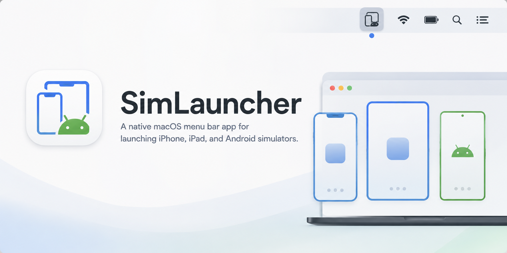

# SimLauncher


<p align="center">
  
</p>

Native macOS menu bar launcher for iPhone, iPad, and Android simulators.

## What is SimLauncher?

SimLauncher is a small macOS menu bar app that opens local mobile simulators without making you start from Xcode, Android Studio, or a terminal.

It has one job: keep simulator launching close to your cursor. Click the menu bar icon, use the compact home panel, choose a platform, choose a category, then launch the device.

The current app supports:

- Apple simulators from CoreSimulator, grouped by device category such as iPhone and iPad
- Android Virtual Devices from the Android SDK emulator
- Open at Login through macOS Login Items
- A no-Dock-icon menu bar app experience

## Preview

The app follows the same compact utility layout as the neighboring `KeepAwake` app: a status card, soft rounded sections, clear action rows, and a quiet menu-bar-first surface.

Simulator selection is handled through embedded launch menus:

```text
SimLauncher
├── iPhone / iPad
│   ├── iPhone
│   │   └── iPhone 17 Pro
│   └── iPad
│       └── iPad Pro
└── Android
    ├── Phone
    │   └── Pixel_6_Pro_API_33
    └── Other
        └── flutter_emulator
```

## Supported runtime environments

| Environment | Discovery method | Launch method | Status |
| --- | --- | --- | --- |
| macOS 13+ | Native app runtime | `MenuBarExtra` | Supported |
| iPhone simulators | `xcrun simctl list devices --json` | `xcrun simctl boot <UDID>` and `open -a Simulator` | Supported |
| iPad simulators | `xcrun simctl list devices --json` | `xcrun simctl boot <UDID>` and `open -a Simulator` | Supported |
| Android AVDs | `emulator -list-avds` | `emulator -avd <AVD_NAME>` | Supported |

## Installing

Clone the repository and build the app bundle locally:

```bash
git clone git@github.com:murilloarturo/sim_launcher.git
cd sim_launcher
./scripts/build_app.sh
open dist/SimLauncher.app
```

You can also open the project in Xcode with XcodeGen:

```bash
cd sim_launcher
xcodegen generate
open SimLauncher.xcodeproj
```

> [!NOTE]
> Android support needs the Android SDK emulator binary. SimLauncher checks `$ANDROID_HOME/emulator/emulator`, `$ANDROID_SDK_ROOT/emulator/emulator`, and `~/Library/Android/sdk/emulator/emulator`, in that order.

## Why SimLauncher?

- **One tiny app for both stacks**
  Use the same menu bar habit for Apple simulators and Android emulators.

- **No terminal ceremony**
  The app wraps the simulator commands you already use, then keeps them reachable from the menu bar.

- **Category-first navigation**
  Long simulator lists stay manageable because devices are grouped by platform and category.

- **Native macOS behavior**
  The app uses SwiftUI, `MenuBarExtra`, and macOS Login Items instead of a web wrapper.

- **Easy to inspect**
  The implementation is a small Swift package with focused parser tests.

## Using SimLauncher

1. Open `dist/SimLauncher.app`.
2. Click the SimLauncher icon in the macOS menu bar.
3. Use the home panel to choose `iPhone / iPad` or `Android`.
4. Pick a category such as `iPhone`, `iPad`, `Phone`, or `Other`.
5. Click a simulator to launch it.

Booted Apple simulators are marked in the launch menu. Use the refresh button if you create or delete simulators while the app is open.

## Agent usage

Agents can use the SimLauncher helper command instead of hand-writing platform-specific launch commands:

```bash
./scripts/simlauncherctl list --json
./scripts/simlauncherctl list --json --platform apple
./scripts/simlauncherctl list --json --platform android
```

Launch with the stable ID from the list output:

```bash
./scripts/simlauncherctl launch --platform apple --id <UDID>
./scripts/simlauncherctl launch --platform android --id <AVD_NAME>
```

A Codex skill is also installed locally as `$simlauncher-devices`. It tells agents to list devices first, select the safest exact ID, then launch through `scripts/simlauncherctl`.

## Commands used by the app

Apple simulator discovery:

```bash
xcrun simctl list devices --json
```

Apple simulator launch:

```bash
xcrun simctl boot <UDID>
open -a Simulator
```

Android AVD discovery:

```bash
emulator -list-avds
```

Android AVD launch:

```bash
emulator -avd <AVD_NAME>
```

## Where SimLauncher is useful

- Switching between iOS and Android app work during development
- Opening a specific simulator before running a build from another tool
- Keeping a small set of daily devices close without opening Xcode or Android Studio
- Working in lightweight editor setups where simulator launch commands are otherwise manual

## Development

Run the tests:

```bash
swift test
```

Build a local app bundle:

```bash
./scripts/build_app.sh
```

Generate and open the Xcode project:

```bash
xcodegen generate
open SimLauncher.xcodeproj
```

## Project structure

```text
Sources/SimLauncher/       SwiftUI app, simulator discovery, launch services
Tests/SimLauncherTests/    Parser tests
Resources/Info.plist       macOS app metadata
scripts/build_app.sh       SwiftPM app bundle helper
scripts/simlauncherctl     Agent-friendly list and launch helper
project.yml                XcodeGen project definition
Assets/                    README and design assets
```

## Links

- GitHub: [murilloarturo/sim_launcher](https://github.com/murilloarturo/sim_launcher)
- Apple simulator tool: `xcrun simctl`
- Android emulator tool: `emulator`

## Roadmap ideas

- Favorites and recent launches
- Search/filter for large simulator catalogs
- Running Android emulator detection through `adb devices`
- Launch status history or a small diagnostics panel
- Signed and notarized release builds
- A dedicated app icon and screenshot-based UI tests

## Contributing

Small, focused changes are easiest to review. Parser changes should include tests for the affected device list format, and UI changes should preserve the compact menu bar home layout.

## License

MIT. See [LICENSE](LICENSE).

## Footnotes

1. SimLauncher does not create simulators or AVDs. Create Apple simulators in Xcode and Android devices in Android Studio first.
2. Android AVD category detection is name-based, so unusual AVD names may appear under `Other`.
